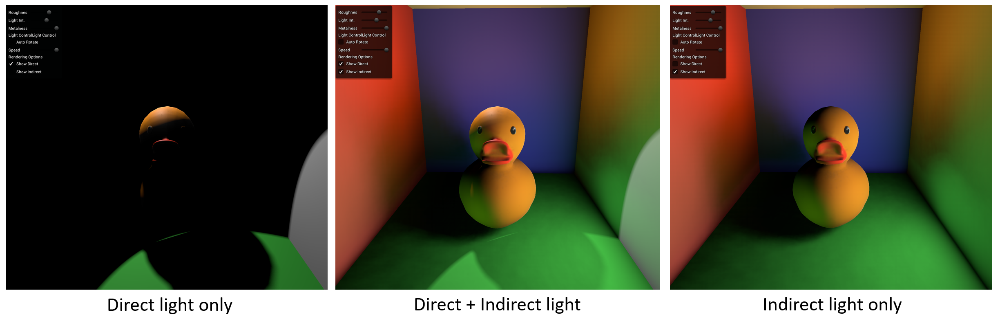
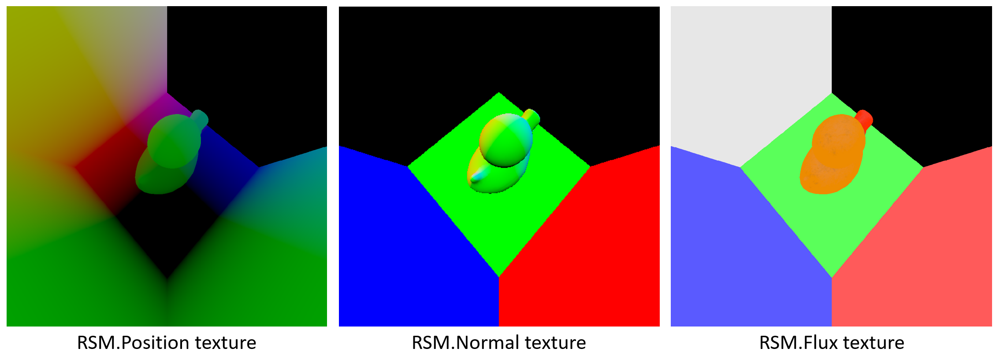
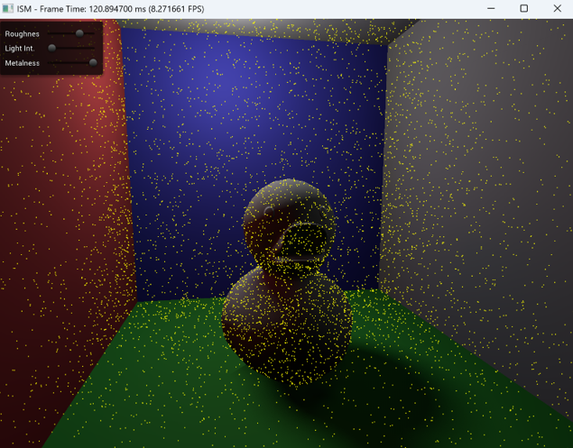
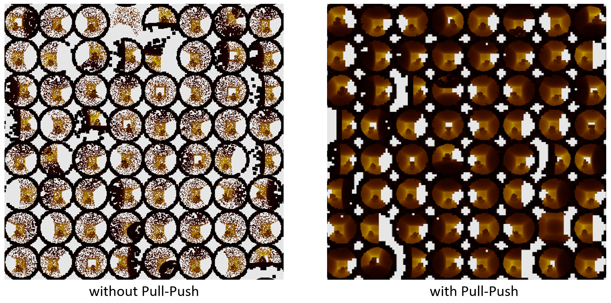
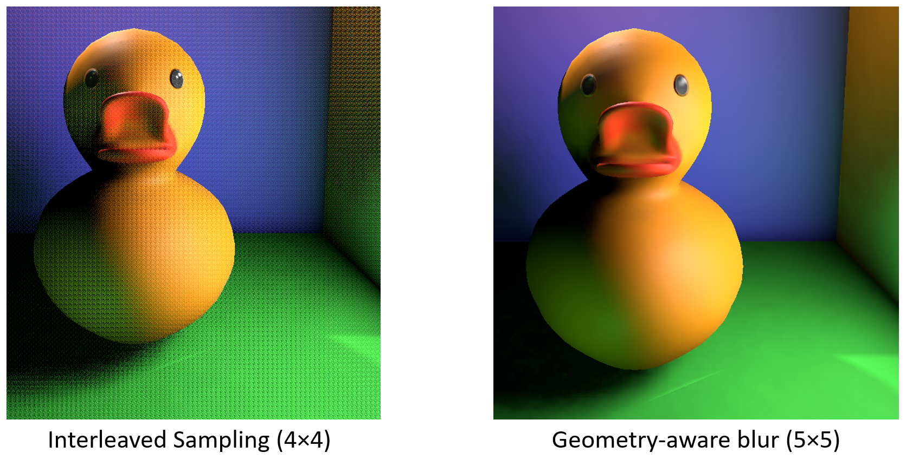
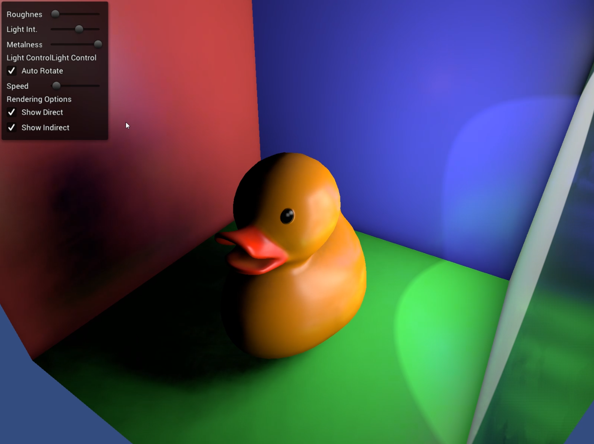

# Imperfect Shadow Maps (ISM) Real-Time GI Contribution

This repository contains the GI-related implementation layers, shader programs, documentation, and code excerpts from my implementation study of **Imperfect Shadow Maps (ISM)** for real-time global illumination.

The work was implemented on top of an academic AR renderer base that already supported **PBR shading** and **PCF shadow mapping**, and this repository intentionally does **not** redistribute the full base renderer. Instead, it focuses on the parts I personally implemented for the ISM-based indirect illumination pipeline.

---

## Overview

This project was a seminar-driven implementation of the paper:

**Imperfect Shadow Maps for Efficient Computation of Indirect Illumination**  
Tobias Ritschel et al., SIGGRAPH Asia 2008

The goal was to reproduce and study a practical real-time GI pipeline that approximates indirect visibility by replacing expensive per-VPL shadow maps with low-quality point-based depth maps, then repairing holes through **Pull-Push**, and finally using them for **visibility-aware indirect lighting**.

The implemented flow is:

1. **VPL generation**
2. **Point-based depth maps**
3. **Pull-Push hole filling**
4. **Shading**

My implementation reproduces that structure in an OpenGL-based renderer and adapts it into a working real-time demo.

---

## What I Implemented

### 1. Reflective Shadow Map (RSM) generation

I implemented an **RSM stage** that stores not only depth, but also **position, normal, and flux** information from the light's point of view.

In my implementation:
- **512×512** single-view RSM
- spotlight-based setup

### 2. GPU-parallel VPL generation

Using the RSM, I generated **Virtual Point Lights (VPLs)** on the GPU with a **compute shader**.

### 3. Point-based ISM construction

Instead of rendering a full shadow map per VPL with original scene geometry, I used a **point-based representation** to build many low-resolution imperfect shadow maps efficiently.

In my implementation:
- each ISM tile is **128×128**
- the full atlas is **4096×4096**
- point cloud preprocessing used **8K points per VPL**
- about **250K total scene points**
- designed for **1024 VPLs**

### 4. Pull-Push hole filling

Point-based depth maps naturally contain holes, so I implemented a **2-level Pull-Push reconstruction stage** on the ISM atlas.

### 5. Deferred shading with indirect visibility

I separated **direct** and **indirect** illumination, rendered them in a deferred-style pipeline, and composited them afterward.

### 6. Interleaved VPL sampling + geometry-aware blur

For indirect illumination, I used:
- **64 random VPLs out of 1024** per fragment
- **5×5 geometry-aware cross bilateral filter** for denoising

---

## Repository Scope

This repository is intentionally **not** a full runnable redistribution of the original project.

It includes:
- GI-related shader programs that I wrote
- code excerpts showing the ISM pipeline integration
- seminar documentation / result images
- implementation notes for the ISM-specific stages

It intentionally excludes:
- the full academic base renderer
- framework-level engine code not authored by me
- third-party or lab-provided project structure
- packaged executable distribution

This separation is intentional because the original project was built on top of an academic renderer base, while this repository is meant to document **my contribution layer only**.

---

## Included Files

### `Shaders/`

Core shader files for the GI pipeline:
- `rsm.vert`, `rsm.frag`
- `vpl.comp`
- `ism.vert`, `ism.frag`
- `pullpush.vert`, `pull.frag`, `push.frag`
- `blur.frag`

Additional helper / debug shaders:
- `point.vert`, `point.frag`

### `Code_Excerpts/ism_pipeline_excerpt.cpp`

A focused excerpt of the pipeline integration code showing the core stages I implemented:
- RSM setup
- VPL compute dispatch
- ISM atlas rendering
- Pull-Push pass
- indirect-light composition path

### `Docs/`

Images captured from the seminar presentation and implementation results.

#### Seminar Material

This project was also presented in a lab seminar as a paper analysis + implementation study.

- [Seminar slides (PDF)](Docs/ISM_Seminar_Slides.pdf)

---

## Pipeline Summary

The implemented pipeline is:

1. Render RSM from the spotlight view
2. Generate VPLs from RSM position / normal / flux
3. Build a point-based ISM atlas for many VPLs
4. Repair holes with Pull-Push
5. Shade indirect light using interleaved VPL sampling
6. Apply geometry-aware cross bilateral blur
7. Composite direct + indirect lighting

---

## Documentation Images

### Reflective Shadow Map (RSM)

The implementation stores the RSM textures needed for VPL generation, including **position**, **normal**, and **flux**.

### Point cloud processing

The scene is preprocessed into a point cloud so that many VPL-specific imperfect depth maps can be generated efficiently without re-rendering full geometry for every VPL.

### Pull-Push reconstruction

The Pull-Push step fills holes caused by sparse point-based depth maps.

### Interleaved sampling and geometry-aware blur

For shading, the implementation uses interleaved VPL sampling and then filters the resulting noise with a geometry-aware blur.

### Final result

---

## Performance

For the seminar demo implementation, the measured average performance was:

- **Average frame time:** 6.5 ms
- **Average frame rate:** 153.8 FPS
- **Resolution:** 1600×1200
- **Hardware:** 5.3 GHz CPU + NVIDIA GeForce RTX 4070 Ti
- **Lighting setup:** single-bounce indirect illumination

This is the implementation-side demo result, distinct from the original 2008 paper’s reported benchmark numbers.

---

## Notes on Quality and Limitations

The method’s strength is that approximate visibility can still produce convincing low-frequency indirect lighting while significantly reducing cost.

Known limitations include:
- good results require a sufficient number of point samples
- too few VPLs can lead to temporal flickering
- light leaking can still appear because ISMs only approximate low-frequency visibility

These trade-offs were part of what made this project valuable as a real-time GI study.

---

## Why This Project Matters

This project was important to me because it was not just a shader exercise. It required:

- understanding a real-time GI paper deeply enough to reconstruct its pipeline
- converting the paper’s ideas into a working OpenGL renderer
- balancing quality and performance using point-based approximations
- implementing visibility-aware indirect lighting, not just simple additive bounce light
- explaining the architecture and limitations clearly in a seminar setting

In short, this project helped me develop the ability to move from:

**graphics paper → working renderer implementation → technical communication**

---

## Seminar / Knowledge Sharing

This implementation was also organized into a lab seminar presentation covering the paper background, pipeline design, implementation details, trade-offs, and measured demo results.

---

## Related Materials

- Reference Paper: [Imperfect shadow maps for efficient computation of indirect illumination, T. Ritschel(SIGGRAPH ASIA '08)](https://dl.acm.org/doi/10.1145/1409060.1409082)
- Seminar slides (PDF): [Docs/ISM_Seminar_Slides.pdf](Docs/ISM_Seminar_Slides.pdf)

---

## Contact

- GitHub: https://github.com/whlee503
- Email: whlee503@ajou.ac.kr
